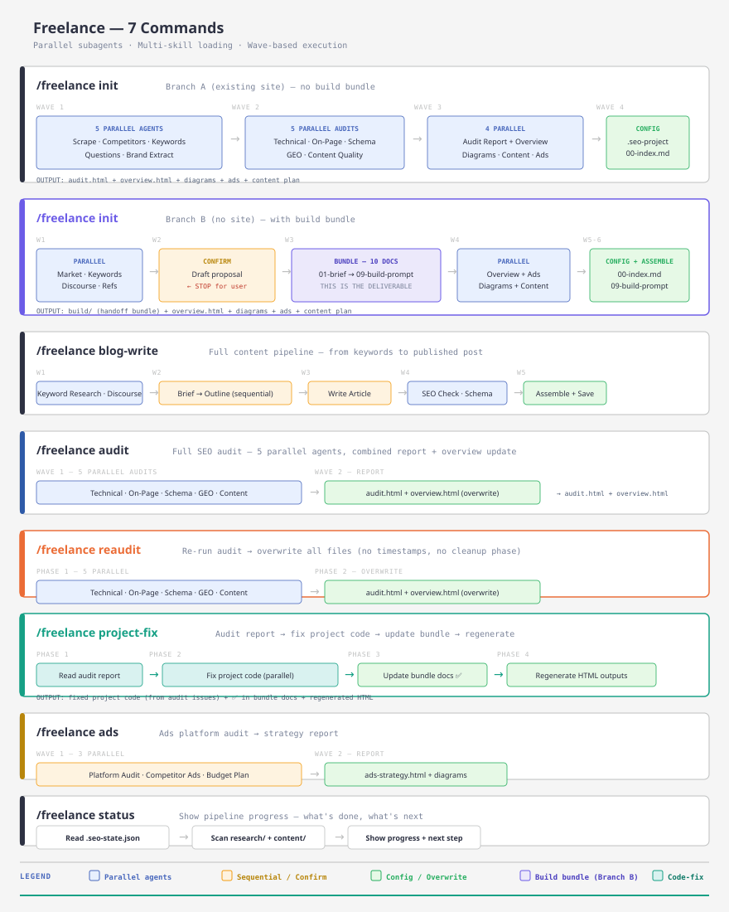
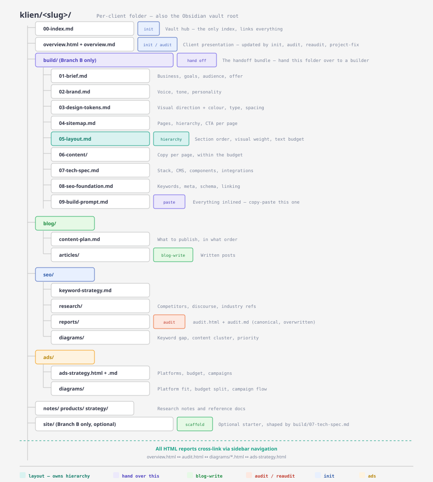

# ✈️ SEO Pilot for Claude Code

SEO Pilot is a complete SEO workflow for Claude Code — 5 commands that handle everything from keyword research to site audits. Each command delegates to specialized skills automatically.


## How It Works



SEO Pilot runs tasks in parallel where possible, then chains dependent steps together.

## Commands

| Command | What It Does |
|---------|--------------|
| `/seo-pilot init` | Scrape site → Competitors → Keywords → SEO Report + Diagrams |
| `/seo-pilot blog-write <topic>` | Keyword research → Brief → Outline → Write → SEO Check → Schema → Publish |
| `/seo-pilot audit <url>` | Technical SEO + On-Page + Schema + GEO + Content Quality → Report |
| `/seo-pilot reaudit <url>` | Clean old audit files → re-run full audit with fresh timestamped output |
| `/seo-pilot status` | Show pipeline progress |

## Install

### One-Command (Recommended)

```bash
curl -fsSL https://raw.githubusercontent.com/Aguh18/claude-seo-pilot/main/install.sh | bash
```

### Clone & Install

```bash
git clone https://github.com/Aguh18/claude-seo-pilot.git
cd claude-seo-pilot
./install.sh
```

## What Gets Created

After `init`, everything lives in `seo-pilot/`:



## Precondition

`blog-write`, `audit`, `reaudit`, and `status` require `seo-pilot/` to exist. If missing:

> Run `/seo-pilot init` first to set up the project.

## Built-in Skills

| Skill | Credit |
|-------|--------|
| seo-pilot | [Aguh18](https://github.com/Aguh18) |
| blog | [Agrici Daniel](https://github.com/AgriciDaniel) |
| seo | [Agrici Daniel](https://github.com/AgriciDaniel) |
| diagram-design | [cathrynlavery](https://github.com/cathrynlavery/diagram-design) |
| defuddle | [Notion Labs](https://github.com/makenotion/defuddle) |
| Serper API | [serper.dev](https://serper.dev) |

## 🤝 Contributing

PRs welcome! See [CONTRIBUTING.md](CONTRIBUTING.md)

## 📝 License

MIT License — see [LICENSE](LICENSE)

---

> Made with ❤️ for anyone who wants to rank on Google
